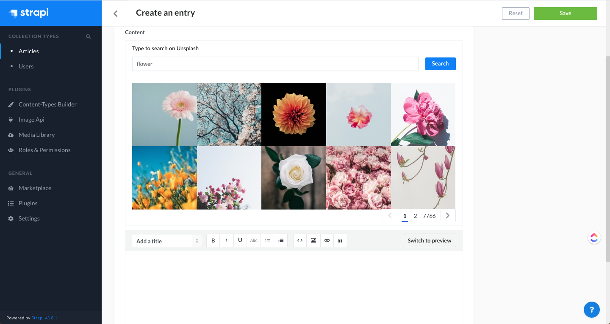
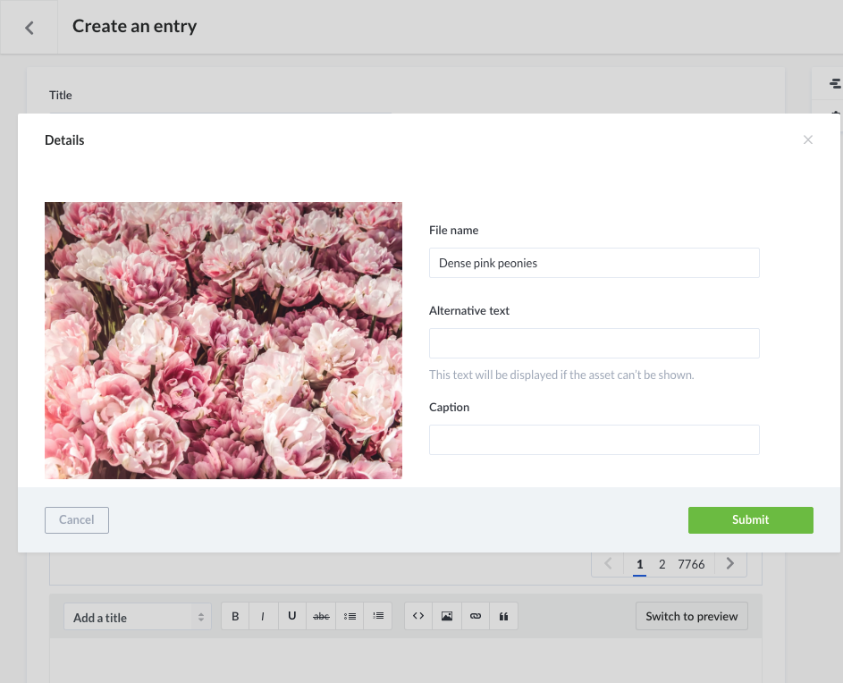
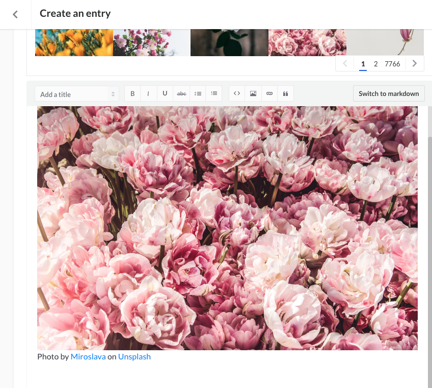

# Strapi plugin image-api

This is a plugin for [strapi](https://github.com/strapi/strapi) 3.0.x

It helps you to search for images on Unsplash and import to your media library and insert to your `Rich Text` content with appropriate attribution.

\***\* This plugin currently isn't compatible with other plugins that override your wysiwyg editor but it works fine if you override the wysiwyg editor yourself by creating file at `/extensions/content-manager/admin/src/components` \*\***

## Screenshots







## Installation

1. Register an Unsplash account [here](https://unsplash.com/developers)
2. Create an app on Unsplash, take a note on your `app name` and your `Access Key`, it will be used later. <i>Note: there would be a limit of 50 requests per hour for a demo app</i>
3. With yarn:

   `yarn add strapi-plugin-image-api`

   With npm:

   `npm install strapi-plugin-image-api`

4. Generate a config file at the path `/extensions/image-api/config/config.json` with below content

   ```json
   {
     "providerOptions": {
       "unsplash": {
         "appName": "YOUR_UNSPLASH_APP_NAME",
         "accessKey": "YOUR_UNSPLASH_ACCESS_KEY"
       }
     }
   }
   ```

5. If you haven't installed any plugins that override your wysiysg editor like [this one](https://github.com/fagbokforlaget/strapi-plugin-wysiwyg-toastui)

   You can create a file under this path `/extensions/content-manager/admin/src/components/WysiwygWithErrors/index.js` with [the content here](./example/extensions/content-manager/admin/src/components/WysiwygWithErrors/index.js)

   Or the other option is the plugin exposed a `ImageApiPanel` component which takes 2 props

   1. `editor` - object of `{ name, value }` props of your wysiysg editor
   2. `onEditorChange` - the onChange event props that strapi passed to your wysiysg editor
